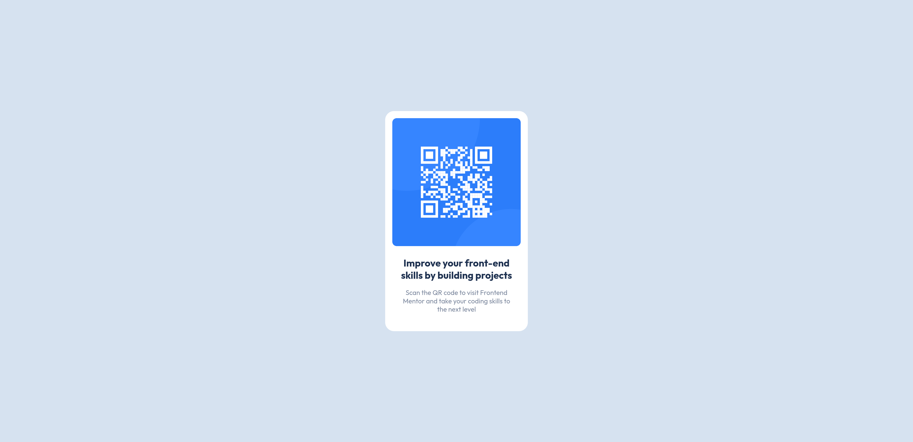

# Frontend Mentor - QR code component solution

This is my solution to the [QR code component challenge on Frontend Mentor](https://www.frontendmentor.io/challenges/qr-code-component-iux_sIO_H). The goal was to create a QR code component that is fully responsive and accessible.

## Table of contents

- [Frontend Mentor - QR code component solution](#frontend-mentor---qr-code-component-solution)
  - [Table of contents](#table-of-contents)
  - [Overview](#overview)
    - [Screenshot](#screenshot)
    - [Links](#links)
  - [My process](#my-process)
    - [Built with](#built-with)
    - [Features](#features)
    - [Testing and Accessibility](#testing-and-accessibility)
    - [Continued development](#continued-development)
  - [Tools I Use](#tools-i-use)
  - [Acknowledgments](#acknowledgments)

## Overview

### Screenshot

Screenshots of the project on desktop and mobile:




### Links

- Live Site URL: [Live Site](https://frontendmentor-qr-code-component-eight.vercel.app/)

## My process

### Built with

- Semantic HTML5 markup
- CSS custom properties
- CSS Grid for centering items
- Mobile-first workflow

### Features

- Utilizing design tokens with CSS properties
- Calculating `rem` values using `px` references: `calc(22 / 16 * 1rem)`
- Using `rem` value as `max-width` for responsive design, ensuring the component looks good even if users change their browser's font size

```css
.card {
  max-width: calc(320 / 16 * 1rem);
  /* other styles */
}
```

### Testing and Accessibility

- Set the browser's font size on desktop to various values to ensure everything scales properly based on the user's preferred font size
- Zoomed the page in and out to check for responsiveness
- Used Firefox DevTools and ResponsivelyApp to check the website's responsiveness

### Continued development

I enjoyed writing pure CSS for this project. I learned to use new tools like Pixel Perfect and ResponsivelyApp. For the next steps, I aim to improve my understanding of when and how to use different values (rem, em, px) for better responsiveness and enhance my ability to notice differences between web implementations and designs.

## Tools I Use

- [CSS Reset by Josh Comeau](https://www.joshwcomeau.com/) - A CSS reset that applies common-sense defaults without resetting the appearance completely
- [Pixel Perfect Pro by max](https://addons.mozilla.org/en-US/firefox/addon/pixel-perfect-pro/) - A Firefox extension that enables you to overlay an image over a webpage, making it easier to spot pixel differences between your result and the design
- [Responsively.app](https://responsively.app/) - A free and open-source tool that allows you to test your webpage on different screen sizes, take screenshots, and much more

## Acknowledgments

- [DarkstartXDD solutions on blog preview card](https://github.com/DarkstarXDD/blog-preview-card) - This helped me get inspiration for creating this documentation and using the Pixel Perfect extension to validate the differences between the web and the design
